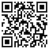

# USA Visa Appointment Checker and Booker

This script, named PowellShell, automates the process of checking and booking USA visa appointment dates. It utilizes PowerShell scripting language and web requests to interact with the USA visa appointment system.

If you find this repository helpful, consider supporting me by clicking [here](https://paypal.me/techwithbeskat) or scanning the QR code below. Thank you!

## Prerequisites

Before using this script, ensure you have the following information:

- `currentApptDate`: The date of your current visa appointment.
- `userEmail`: Your email address used for the visa appointment system.
- `userPassword`: Your regular password for the visa appointment system.
- `scheduleId`: The schedule ID for visa appointments.
- `locationId`: The location ID where you want to schedule the appointment.
- `senderEmail`: The email address from which notification emails will be sent.
- `senderPassword`: The [app password](https://support.google.com/accounts/answer/185833?hl=en) for the sender email account (generated specifically for this script).
- `recipientEmail`: The email address to which notification emails will be sent.
- `baseUrl`: The base URL for the visa appointment system.
- `waitMinute`: The duration (in minutes) to wait before each appointment check. By default, it is set to 1 minute and can be adjusted as needed.
- Other URLs and parameters used in the script.

## Usage

Update the script with your specific parameters mentioned above.

### Running on Windows

1. Open PowerShell:
    - Press `Win + X`.
    - Select "Windows PowerShell" or "Windows PowerShell (Admin)".
2. Navigate to the directory where the script (`visa-checker.ps1`) is located using `cd` command.
3. Run the script by typing `.\visa-checker.ps1` and pressing Enter.

### Running on MacOS

1. Ensure PowerShell is installed:
    - Open Terminal (`Cmd + Space`, type "Terminal", press Enter).
    - Type `pwsh` and press Enter.
    - If PowerShell is installed, the PowerShell prompt (`PS >`) will appear.
    - If PowerShell is not installed, follow the instructions on the [PowerShell GitHub page](https://github.com/PowerShell/PowerShell) to install it.
2. Once PowerShell is installed, navigate to the directory where the script (`visa-checker.ps1`) is located using `cd` command in Terminal.
3. Run the script by typing `pwsh ./visa-checker.ps1` and pressing Enter.

### Running in an Integrated Development Environment (IDE)

1. Open your preferred IDE (e.g., IntelliJ, Visual Studio Code, PowerShell ISE).
2. Open the script (`visa-checker.ps1`) in the IDE.
3. Ensure the correct parameters are set within the script.
4. Execute the script using the IDE's execution commands (e.g., "Run Script", "Execute", "Debug").

## Description

The script performs the following steps:

1. Sends a login request to the visa appointment system.
2. Retrieves available appointment dates.
3. Checks for the closest available date.
4. Sends an email notification if a closer date is found.
5. If the closest date is before the specified current appointment date, books the appointment.

## Important Notes

- Ensure that the script is executed in a secure environment.
- Review and understand the script before running it.
- Use valid and authorized credentials for the visa appointment system.
- Adjust the `waitMinute` parameter according to your preference for checking intervals.
- Create an [app password](https://support.google.com/accounts/answer/185833?hl=en) for your Gmail account and use it for the `senderPassword` parameter.

## Disclaimer

This script is provided for educational and informational purposes only. Use it at your own risk. The author assumes no responsibility or liability for any consequences resulting from the use of this script.

